# Introduction to SQL
### Ishrar Nazah Chowdhury
### Reg. No. - 2019331104
## CREATE TABLE
``` sql
CREATE TABLE department
(
    dept_name varchar(20),
    building varchar(15),
    budget numeric(12,2),
    primary key (dept_name)
)
CREATE TABLE course
(
     course_id		varchar(8), 
	 title			varchar(50), 
	 dept_name		varchar(20),
	 credits		numeric(2,0) check (credits > 0),
	 primary key (course_id),
	 foreign key (dept_name) references department
		on delete set null
)
CREATE TABLE instructor
(
     ID			varchar(5), 
	 name			varchar(20) not null, 
	 dept_name		varchar(20), 
	 salary			numeric(8,2) check (salary > 29000),
	 primary key (ID),
	 foreign key (dept_name) references department
		on delete set null
)
CREATE TABLE section
(
    course_id		varchar(8), 
    sec_id			varchar(8),
	semester		varchar(6)
		check (semester in ('Fall', 'Winter', 'Spring', 'Summer')), 
	year			numeric(4,0) check (year > 1701 and year < 2100), 
	building		varchar(15),
	room_number		varchar(7),
	time_slot_id		varchar(4),
	primary key (course_id, sec_id, semester, year),
	foreign key (course_id) references course
		on delete cascade,
	foreign key (building, room_number) references classroom
		on delete set null
)    
CREATE TABLE teaches
(
    ID			varchar(5), 
	course_id		varchar(8),
	sec_id			varchar(8), 
	semester		varchar(6),
	year			numeric(4,0),
	primary key (ID, course_id, sec_id, semester, year),
	foreign key (course_id,sec_id, semester, year) references section
		on delete cascade,
	foreign key (ID) references instructor
		on delete cascade
)
```

## DROP TABLE 
``` sql
DROP TABLE instructor
```

This deletes all tuples of  _instructor_, as well as the schema for _instructor_. After  _instructor_ is dropped, no tuples can be inserted into  _instructor_ unless it is re-created with the `CREATE TABLE` command.

## DELETE FROM 
``` sql
DELETE FROM instructor
```
This retains the relation _instructor_ but deletes all tuples in _instructor_.


## ALTER TABLE
``` sql
ALTER TABLE instructor ADD address varchar(20)
```


``` sql
ALTER TABLE instructor drop address
```
We can drop and add attributes in a relation using `ALTER TABLE`

## QUERIES ON A SINGLE RELATION 

To find names of all instructors in the university database: 
``` sql
SELECT name FROM instructor
```


 The instructor's name appears in the name attribute, and then we put in a `select` clause.

To find the department names of all instructors: 
``` sql
SELECT dept_name FROM instructor
```


The result of the above query is aa relation containing all department names, which may contain duplicate values as well since more than one instructors can belong to a department. If we want to force the elimination of duplicates, we insert the keyword `distinct` after `select`. 
``` sql
SELECT distinct dept_name FROM instructor
```


The result of the above query would contain each department name at most once. 

SQL allows us to use the keyword all to specify explicity that duplicates are not removed. 
``` sql
SELECT all dept_name FROM instructor
```

But duplicate retention is defualt, so using `all` is not suggested. 

SQL clause may also contain arithmetic expressions involving operators like `+ , -, *, /` operating on constants or attributes of tuples. 
``` sql
SELECT ID, name, dept_name, salary*1.1 FROM instructor
```

This query returns a relation that is the same as the `instructor` relation, except that the attribute `salary` is mulitiplied by 1.1. This does not result in any change to the `instructor` relation.

To find the names of all instructors in the Computer Science department who have salary greater than $70,000:
``` sql
SELECT name from instructor where dept_name = 'Comp. Sci.' and salary>70000
```


## QUERIES ON MULTIPLE RELATIONS

To retrieve names of all instructors along with their department names and department building name: 

``` sql
select name, instructor.dept_name, building from instructor, department where instructor.dept_name = department.dept_name
```

Cartesian product of the `instructor` relation with `teaches` relation is as follows: 
``` sql
SELECT * FROM instructor, teaches
```
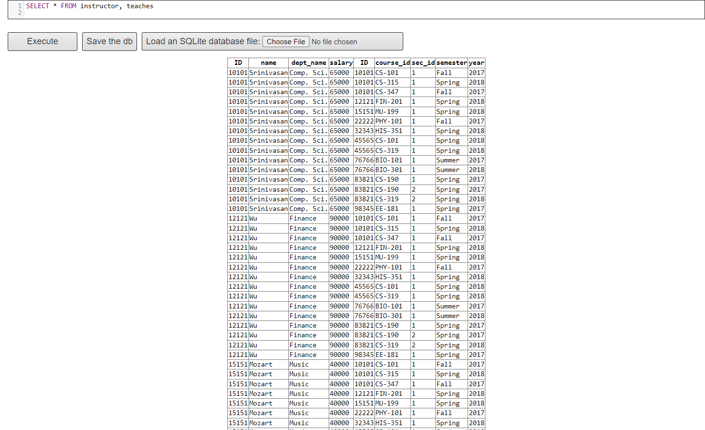
This results in tuples(12*13 = 156) from `instructor` and `teaches` that are unrelated to each other. Instead, we would want a query involving instructor and teaches to combine a particular tuple t in instructor with only those tuples in teaches that refer to the same instructor to which t refers.
``` sql
SELECT name,course_id FROM instructor, teaches where instructor.ID = teaches.ID
```
 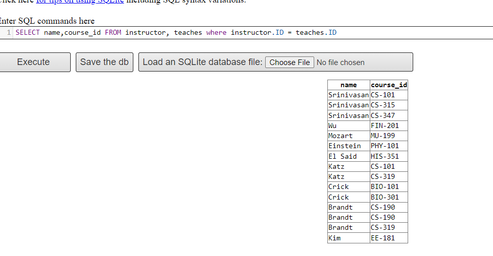

 If we wished to find only instructor names and course identifiers for instructors in the Computer Science departmnet, we could add an extra predicate to the `where` clause:
 ``` sql
SELECT name,course_id FROM instructor, teaches where instructor.ID = teaches.ID and instructor.dept_name = 'Comp. Sci.'
```
 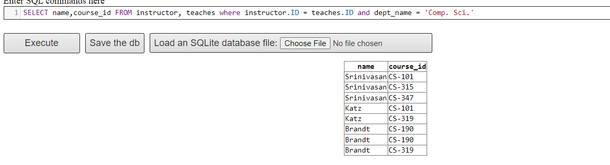

 ## THE RENAME OPERATION
 
 The `as` clause appears in both the `select` and `from` clauses.
 - If we want the attribute name `name` to be replaced with the 
    name `instructor_name`, we can write:
    ``` sql
    SELECT name as instructor_name, course_id FROM instructor, teaches WHERE instructor.ID = teaches.ID
    ```
    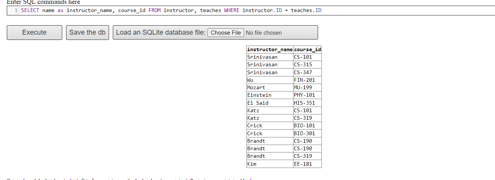

 - to find names and course_ID all instructors in the university who have taught some course.
    ``` sql
    SELECT T.name, S.course_id FROM instructor as T, teaches as S WHERE T.ID = S.ID
    ```
    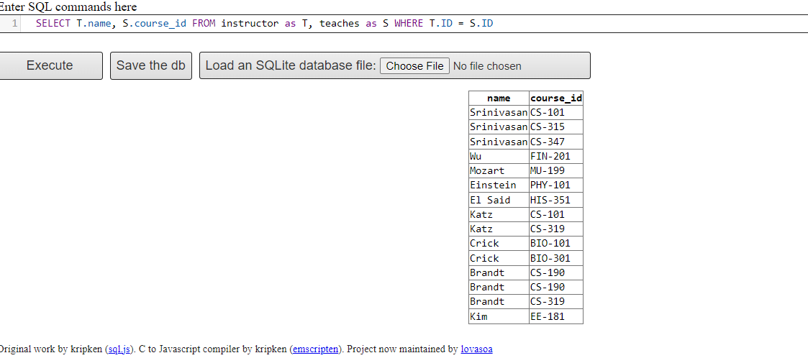
- To compare tuples in the same relation, we would need cartesian product of a relation with itself, and without renaming, it would be impossible to distinguish one tuple from the other. For example, to find the names of all instructors whose salary is strictly greater than atleast one instructor in the Biology department,  
     ``` sql
    SELECT distinct T.name FROM instructor as T, instructor as S WHERE T.salary > S.salary and S.dept_name = 'Biology'
    ```
    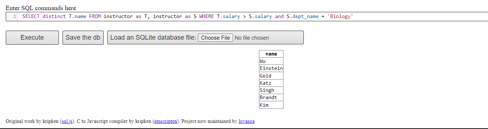


## STRING OPERATIONS

To find the names of all departments whose building name includes the substring 'Watson':
``` sql
SELECT dept_name from department where building like %'Watson'%
```
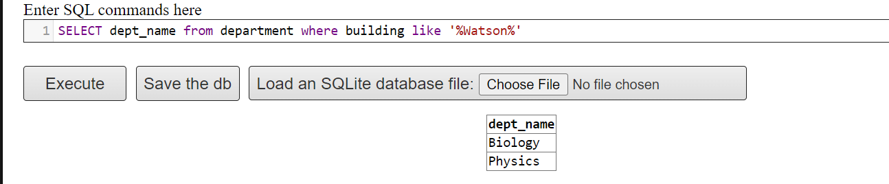

## ATTRIBUTE SPECIFICATION IN THE SELECT CLAUSE

The asterisk  `*` can be used in the `select` clause to denote "all attributes".
``` sql
select instructor.* from instructor, teaches where instructor.ID = teaches.ID
```
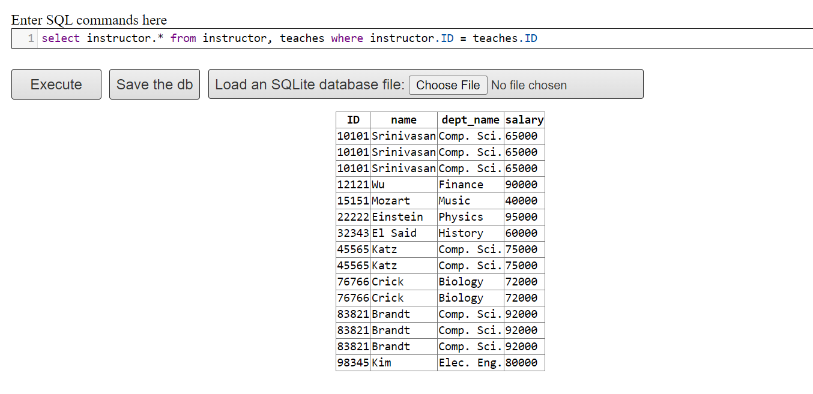

## ORDERING THE DISPLAY OF TUPLES

To list in alphabetic order all instructors in the Physics department: 
``` sql
select name from instructor where dept_name = "Physics" order by name
```
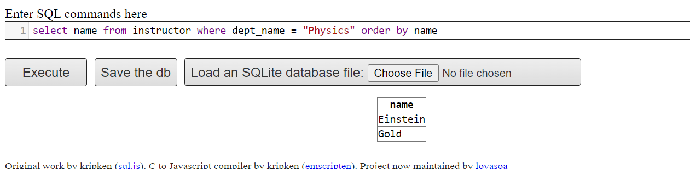

To list the entire `instructor` relation in descending order of `salary`, but ascending order of `name`:
``` sql
select * from instructor order by salary desc, name asc
```
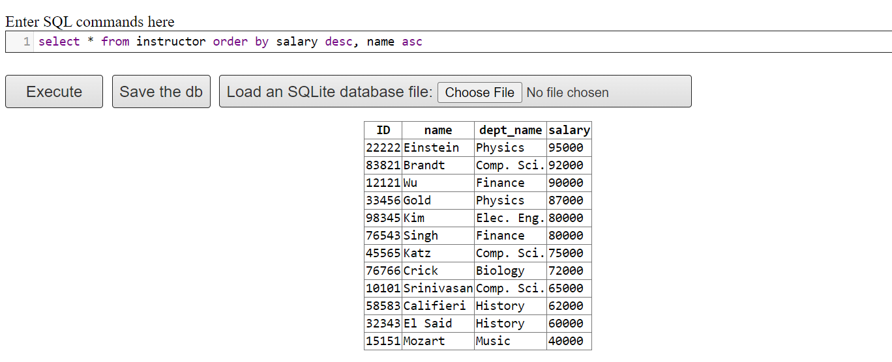

## WHERE - CLAUSE PREDICATES 

To find the names of instructors with salary amounts between $90,000 and $100,000, we use the `between` comparison operator
``` sql
select name from instructor where salary between 90000 and 100000
```
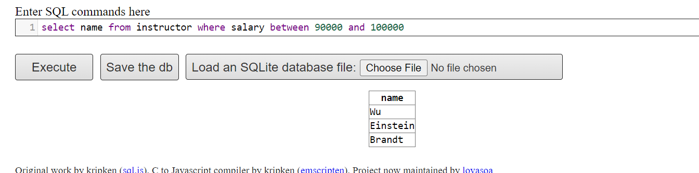

``` sql
select name from instructor where salary between 90000 and 100000
```
The following qeury , 
``` sql
SELECT name,course_id FROM instructor, teaches where instructor.ID = teaches.ID and dept_name = 'Biology'
```
can be rewritted as
``` sql
SELECT name,course_id FROM instructor, teaches where (instructor.ID,dept_name)=(teaches.ID,'Biology')
```
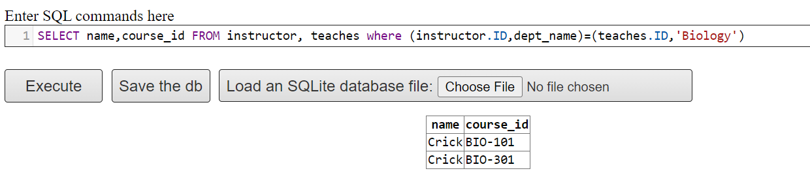

## SET OPERATIONS
__QUERY 1__:
The set of all courses taught in Fall 2017 semester
``` sql
SELECT course_id FROM section where (semester, year) = ('Fall', 2017)
```
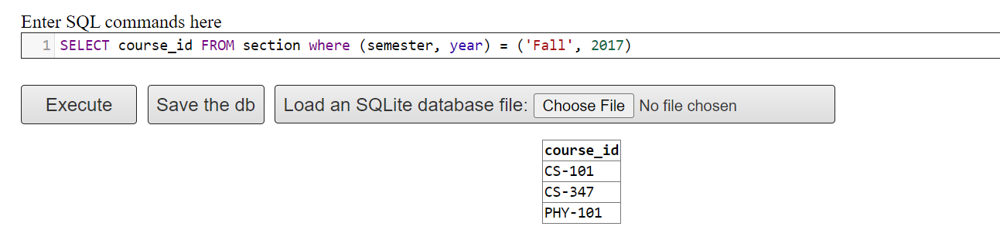
__QUERY 2__:
The set of all courses taught in the Spring 2018 semester
``` sql
SELECT course_id FROM section where (semester, year) = ('Spring', 2018)
```
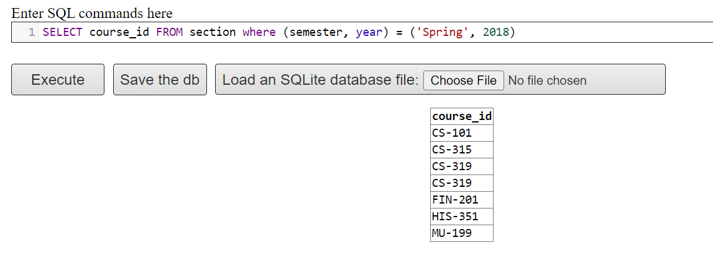
## UNION OPERATION
__QUERY 3__:
Set of all courses taught either in Fall 2017 or Spring 2018, or both
``` sql
SELECT course_id FROM section where (semester, year) = ('Fall', 2017)
union
SELECT course_id FROM section where (semester, year) = ('Spring', 2018)
```
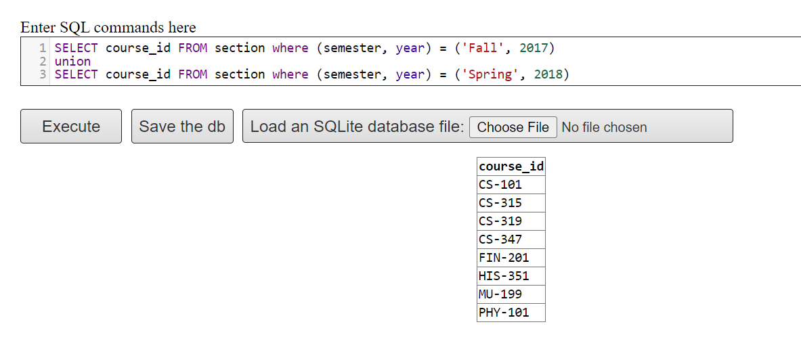
The `union` operation automatically eliminates duplicates. If you want to retain all duplicates, write `union all` in place of `union` 
``` sql
SELECT course_id FROM section where (semester, year) = ('Fall', 2017)
union all
SELECT course_id FROM section where (semester, year) = ('Spring', 2018)
```
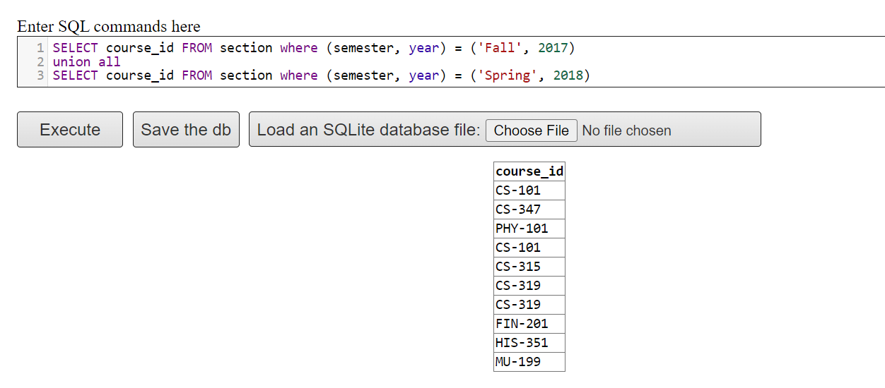

## INTERSECT OPERATION

To find the set of all courses taught in both the Fall 2017 and Spring 2018
``` sql
SELECT course_id FROM section where (semester, year) = ('Fall', 2017)
intersect
SELECT course_id FROM section where (semester, year) = ('Spring', 2018)
```
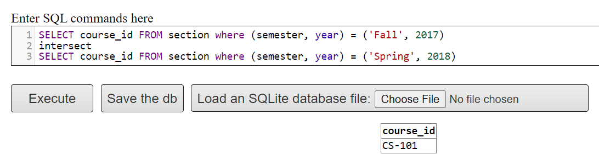
To retain duplicates, 
``` sql
SELECT course_id FROM section where (semester, year) = ('Fall', 2017)
intersect all
SELECT course_id FROM section where (semester, year) = ('Spring', 2018)
```

## EXCEPT OPERATION
To find the courses taught in Fall 2017 semester but not in the Spring 2018 semester:
``` sql
SELECT course_id FROM section where (semester, year) = ('Fall', 2017)
except
SELECT course_id FROM section where (semester, year) = ('Spring', 2018)
```
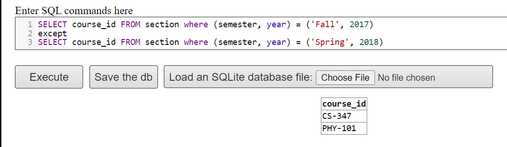
If you want to retain duplicates, write `except all` instead of `except`
``` sql
SELECT course_id FROM section where (semester, year) = ('Fall', 2017)
except all
SELECT course_id FROM section where (semester, year) = ('Spring', 2018)
```

## NULL VALUES

Find all instructors who appear in the `instructor` relation as null values for `salary`,
``` sql
SELECT name FROM instructor where salary is null
```
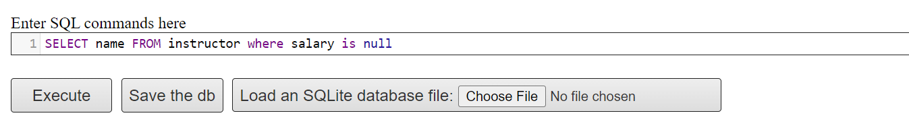

SQL allows us to test whether the result of a comparison is unknown, rather than true or false.
``` sql
SELECT name FROM instructor where salary>10000 is unknown
```

## AGGREGATE FUNCTIONS

### BASIC AGGREGATION
Find the average salary of instructors in the Computer Science department:
``` sql
SELECT avg(salary) FROM instructor where dept_name = "Comp. Sci."
```
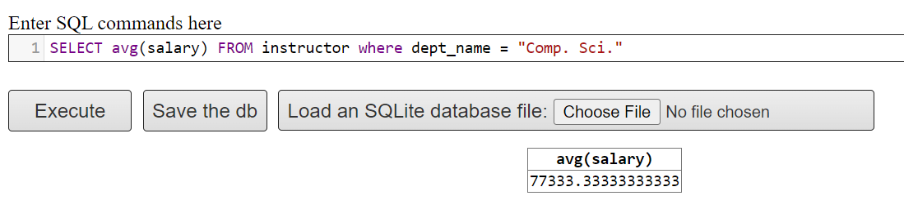
The database system may give an awkward name to the result relation attribute, so we give a meaningful name to the attribute using the `as` clause: 
``` sql
SELECT avg(salary) as avg_salary FROM instructor where dept_name = "Comp. Sci."
```
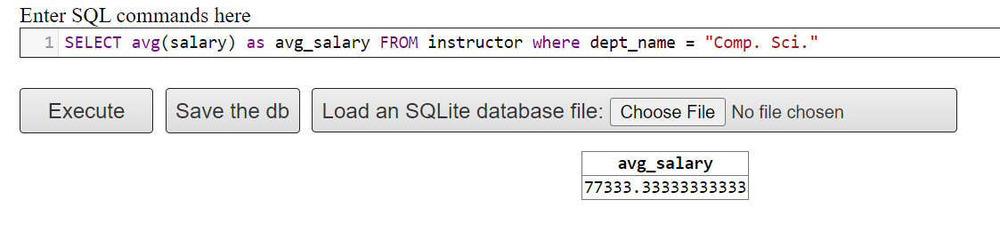

Find the total number of instructors who teach a course in the Spring 2018 semester:
``` sql
SELECT count(distinct ID) FROM teaches where (semester,year)=('Spring',2018)
```
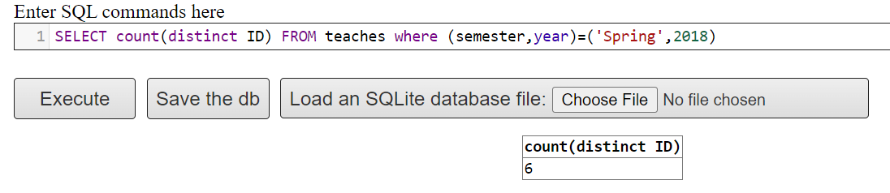

We can use the aggregate function `count` to count the number of tuples in a relation.
``` sql
SELECT *count(*) FROM course
```
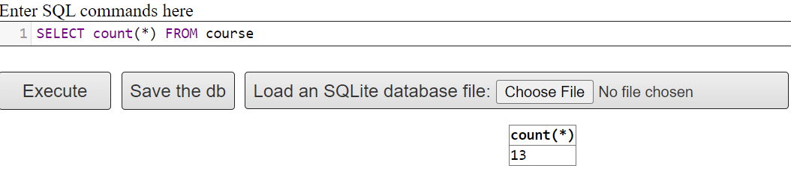

### AGGREGATION WITH GROUPING
`group by` clause are used to form groups.
To find the average salary in each department:
``` sql
SELECT dept_name, avg(salary) as average_salary FROM instructor group by dept_name
```
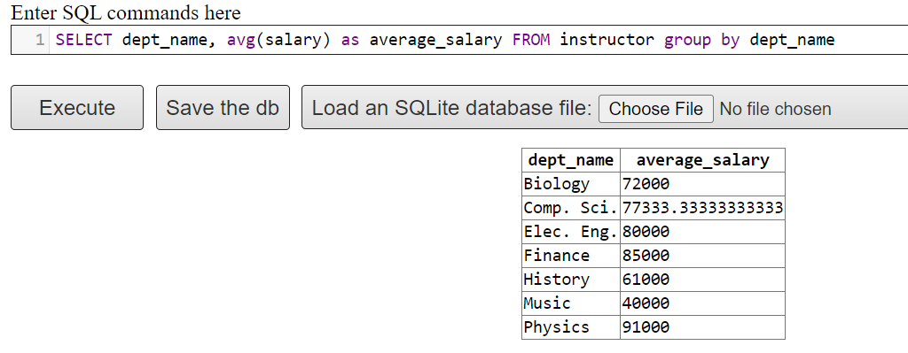

To find the average salary of all instructors
``` sql
SELECT avg(salary) FROM instructor 
```
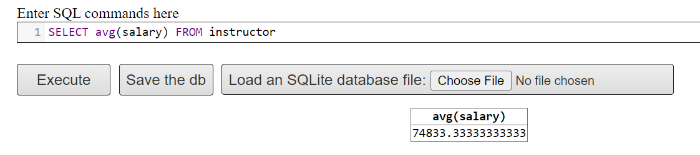

To find the number of instructors in each department who teach a course in the Spring 2018 semester
``` sql
SELECT dept_name, count(distinct teaches.ID) as instructor_count FROM instructor,teaches where 
instructor.ID = teaches.ID and semester = 'Spring' and year = 2018 group by dept_name
```
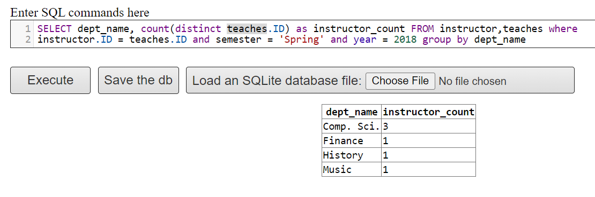

### THE HAVING CLAUSE

To find the average salary of instructors in those departments where the average salary is more than $42,000:
``` sql
SELECT dept_name, avg(salary) as avg_salary from instructor group by dept_name having avg(salary)>42000
```
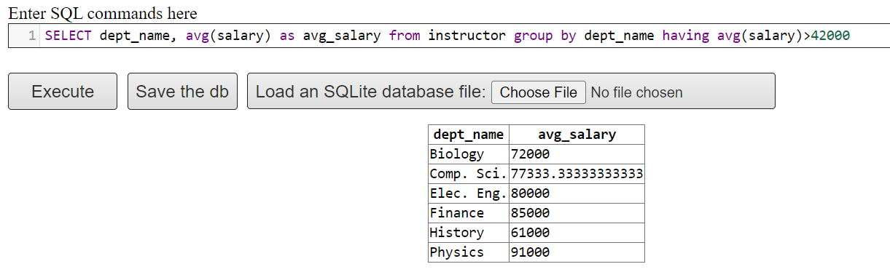

__QUERY:__ For each course section offered in 2017, find the average total credits (tot_cred) of all students enrolled in the section, if section has at least 2 students
``` sql
SELECT course_id, semester, year, sec_id, avg(tot_cred) FROM student, takes WHERE
student.ID = takes.ID and year = 2017
group by course_id, semester, year, sec_id
having count(ID)>=2
```
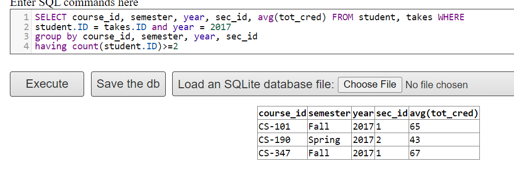

<br></br>
## NESTED SUBQUERIES

### SET MEMBERSHIP
To find all courses taught in both the Fall 2017 and Spring 2018 semesters:
``` sql
SELECT distinct course_id from section where semester = 'Fall' and year = 2017
and course_id in (select course_id from section where semester = 'Spring' and year = 2018)
```
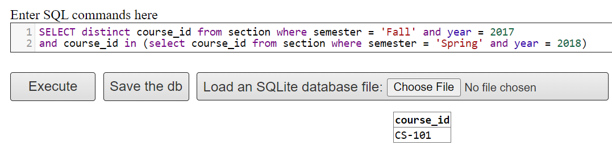

To find all courses taught in the Fall 2017 semester but not in the Spring 2018 semester, 
``` sql
SELECT distinct course_id from section where semester = 'Fall' and year = 2017
and course_id not in (select course_id from section where semester = 'Spring' and year = 2018)
```
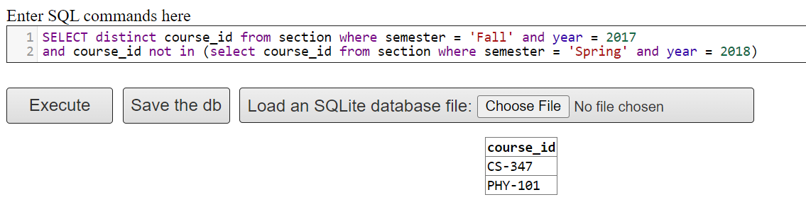

To select the names of instructors whose names are neither "Mozart" nor "Einstein":
``` sql
SELECT distinct name FROM instructor where name not in ('Mozart','Einstein')
```
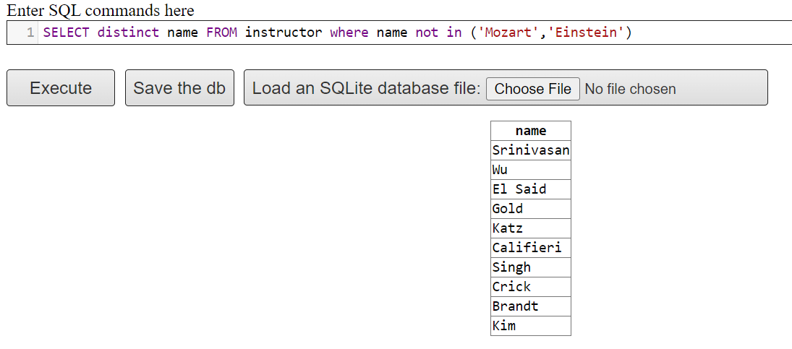

To find the total number of (distinct) students who have taken course sections taught by the instructor with ID 11011
``` sql
SELECT count(distinct ID) 
from takes
where (course_id, sec_id, semester, year) in (select course_id, sec_id, semester, year
from teaches
where teaches.ID = '10101')
```
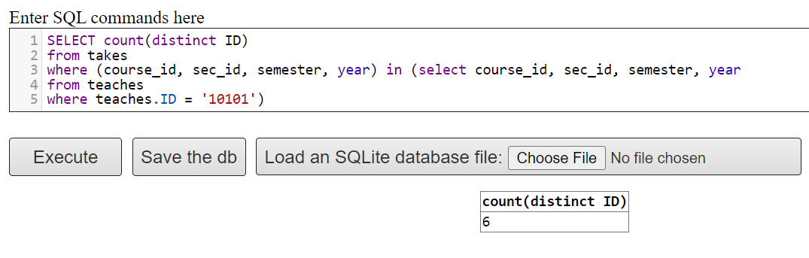


### SET COMPARISON
To find the names of all instructors whose salary is greater than at least one instructor in the Biology department:
``` sql
SELECT name from instructor where salary > some(
	select salary
	from instructor
	where dept_name = 'Biology'
)
```
If we want to find the names of all instructors that have a salary value greater than that of each instructor in the Biology department,
``` sql
SELECT name
from instructor
where salary > all (
	select salary
	from instructor
	where dept_name = 'Biology'
)
```

To find the departments that have the highest average salary,
``` sql
SELECT dept_name
FROM instructor
GROUP BY dept_name
having avg(salary)>= all(
	select avg(salary)
	from instructor
	group by dept_name
)
```

### TEST FOR EMPTY RELATIONS
Another way to find all courses taught in both the Fall 2017 semester and in the Spring 2018 semester:
``` sql
SELECT course_id
FROM section as S
where semester = 'Fall' and year = 2017
and
exists(
	select * 
	from section as T
	where semester = 'Spring' and year = 2018 and
	S.course_id = T.course_id
)
```
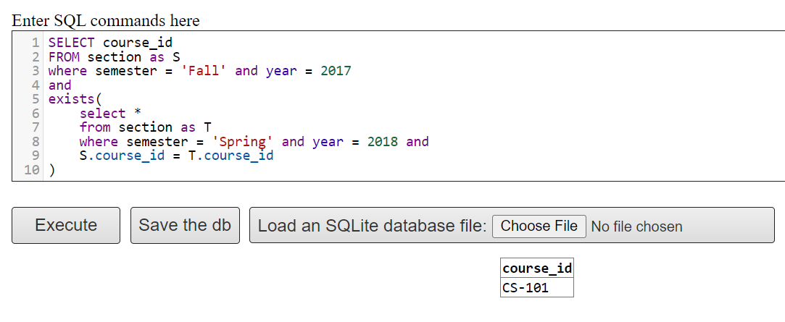

To find all students who have taken all courses offered in the Biology department:
``` sql
select S.ID , S.name
from student as S
where not exists((select course_id
from course
where dept_name = 'Biology')
except (select T.course_id
from takes as T
where S.ID = T.ID))
```

To find the total number of (distinct) students who have taken course sections taught by the instructor with ID 10101
``` sql
select count(distinct ID)
from takes
where exists(
	select course_id, sec_id, semester, year
	from teaches
	where teaches.ID = '10101'
	and takes.course_id = teaches.course_id
	and takes.sec_id = teaches.sec_id
	and takes.semester = teaches.semester
	and takes.year = teaches.year
)
```
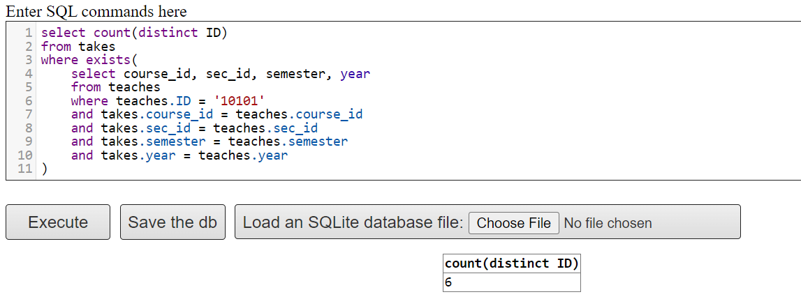

### TEST FOR THE ABSENCE OF DUPLICATE TUPLES

To find all courses that were offered at most once in 2017:
``` sql
select T.course_id
from course as T
where unique(select R.course_id
	from section as R
	where T.course_id = R.course_id and
	R.year = 2017
)
```

An equivalent version of this query not using the `unique` construct is:
``` sql
select T.course_id
from course as T
where 1 >= (select count(R.course_id)
from section as R
where T.course_id = R.course_id and R.year = 2017)
```
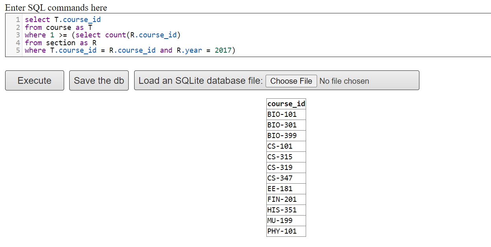

To find all courses that were offered at least twice in 2017:
``` sql
select T.course_id
from course as T
where not unique(
	select R.course_id
	from section as R
	where T.course_id = R.course_id and
	R.year = 2017
)
```

### SUBQUERIES IN THE FROM CLAUSE
To find the average instructors' salaries of those departments where the average salary is greater than $42,000:
``` sql
select dept_name, avg_salary
from(
	select dept_name, avg(salary) as avg_salary
	from instructor
	group by dept_name
)
where avg_salary > 42000
```
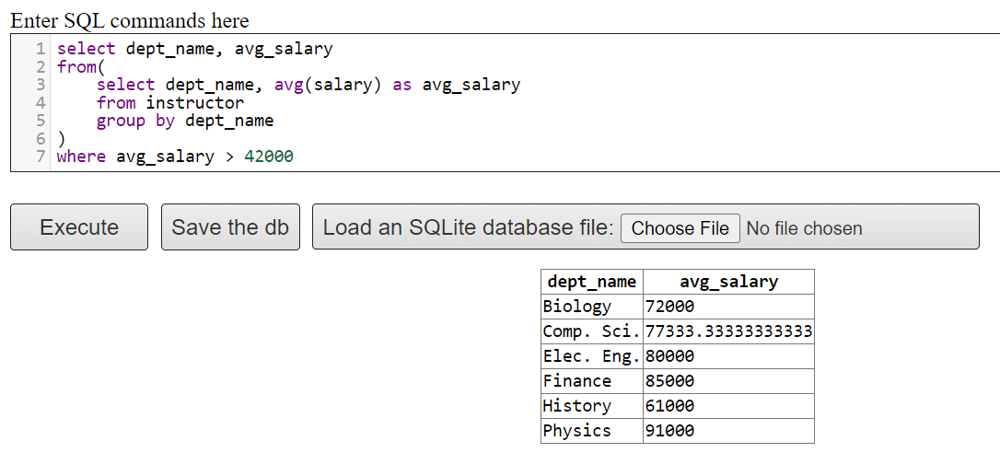

We can give the subquery result relation a name, and rename the attributes, using the as clause,
``` sql
select dept_name, avg_salary
from(
	select dept_name, avg(salary)
	from instructor
	group by dept_name)
	as dept_avg(dept_name, avg_salary)
where avg_salary > 42000	

```

To find the maximum accross all departments of the total of all instructors:
``` sql
select max(tot_salary)
from(
	select dept_name, sum(salary)
	from instructor
	group by dept_name)
	as dept_total(dept_name, tot_salary)


```
If we wish to print the names of each instructor, along with their salary and
the average salary in their department,
``` sql
select name, salary, avg salary
from instructor I1, lateral (select avg(salary) as avg salary

from instructor I2
where I2.dept_name= I1.dept_name)
```

### THE WITH CLAUSE
To find those departments with the maximum budget:
``` sql
with max_budget (value) as
(select max(budget)
from department)
select budget
from department, max_budget
where department.budget = max_budget.value
```
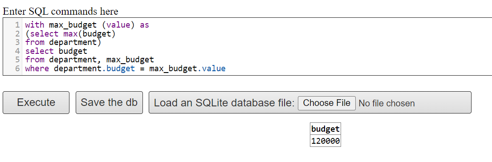
To find all departments where the total salary is greater than the average of the total salary at all departments,
``` sql
with dept_total (dept_name, value) as
(select dept_name, sum(salary)
from instructor
group by dept_name),
dept_total_avg(value) as
(select avg(value)
from dept_total)
select dept_name
from dept_total, dept_total_avg
where dept_total.value > dept_total_avg.value
```
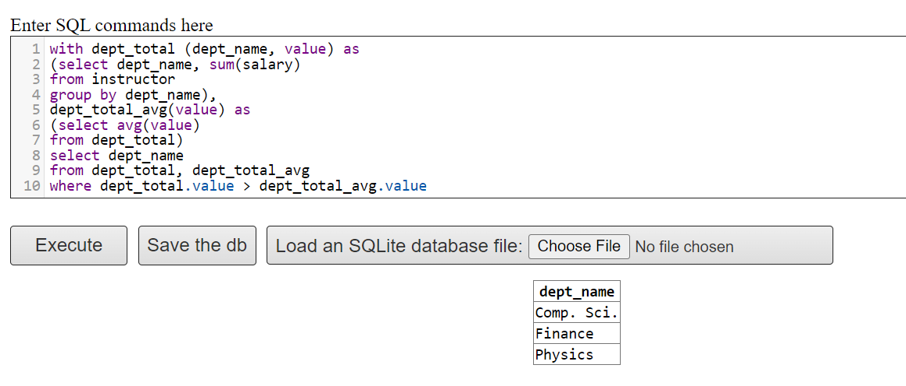

### SCALAR SUBQUERIES
To find list of all departments along with the number of instructors in each department:
``` sql
select dept_name,
(select count(*)
from instructor
where department.dept_name = instructor.dept_name)
as num_instructors
from department
```
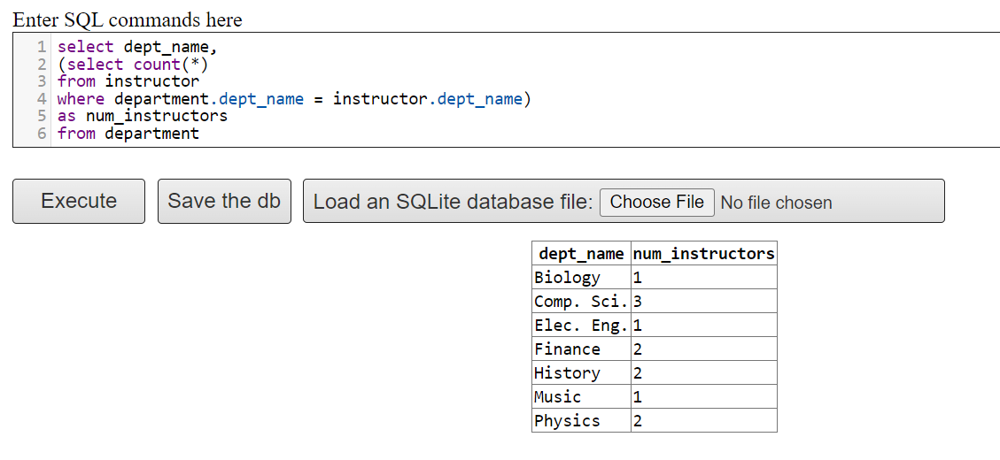

### SCALAR WITHOUT A FROM CLAUSE
If we need find the average number of sections taught (re-
gardless of year or semester) per instructor, with sections taught by multiple instructors counted once per instructor,
``` sql
(select count (*) from teaches)/(select count (*) from instructor)
```
While this is legal in some systems, others will report an error due to the lack of a
`from` clause. So, we rewrite this as
``` sql
select (select count (*) from teaches)/(select count (*) from instructor)
from dual;
```

### DELETION
- Delete all tuples in the instructor relation pertaining to instructors in the Finance
department.
	``` sql
	delete from instructor
	where dept_name = 'Finance'
	```

- Delete all instructors with a salary between $13,000 and $15,000.
	``` sql
	delete from instructor
	where salary between 13000 and 15000
	```
- Delete all tuples in the instructor relation for those instructors associated with a
department located in the Watson building.	
	``` sql
	delete from instructor
	where dept_name in (select dept_name
	from department
	where building = 'Watson')
	```
- To delete the records
of all instructors with salary below the average at the university.
	``` sql
	delete from instructor
	where salary < (select avg (salary)
	from instructor)
	```

### INSERTION
To insert the fact that there is a course CS-437 in the Computer Science department
with title “Database Systems” and four credit hours,

``` sql
insert into course
values ('CS-437', 'Database Systems', 'Comp. Sci.', 4)
```
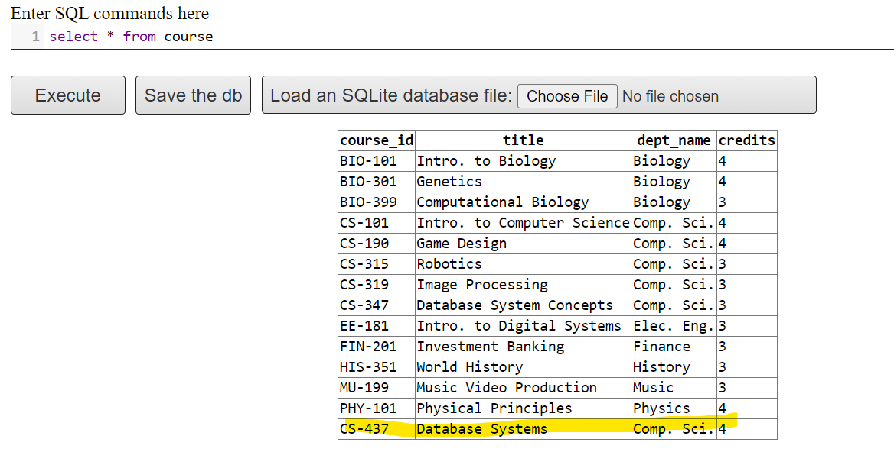

For the benefit of users who may not remember the order of the attributes, SQL allows the attributes to be specified as part of the `insert` statement.
For example, the following SQL insert statements are identical in function to the preceding one:
``` sql
insert into course (course id, title, dept_name, credits)
values ('CS-437', 'Database Systems', 'Comp. Sci.', 4)
```

To make each student in the Music department who has earned
more than 144 credit hours an instructor in the Music department with a salary of
$18,000.
``` sql
insert into instructor
select ID, name, dept_name, 18000
from student
where dept_name = 'Music' and tot_cred > 144
```

``` sql
insert into student
values ('3003', 'Green', 'Finance', null)
```
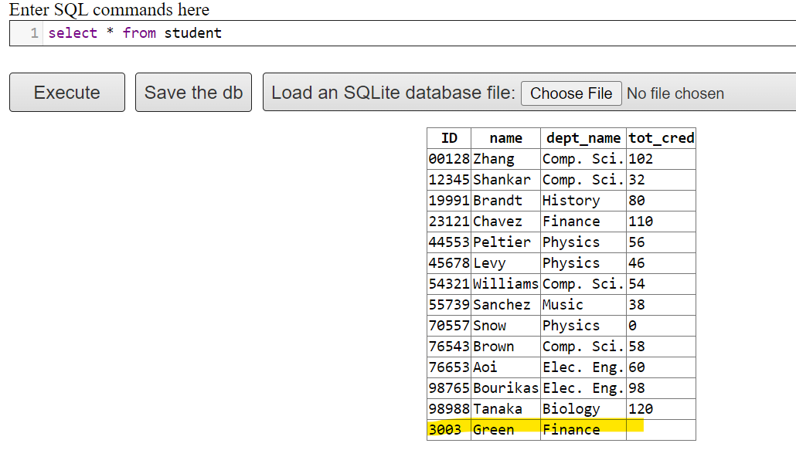

The tuple inserted by this request specified that a student with ID “3003” is in the Finance department, but the tot cred value for this student is not known.


### UPDATES
To increase the salaries of all instructors to be increased by 5 percent,
``` sql
update instructor
set salary= salary * 1.05
```
If a salary increase is to be paid only to instructors with a salary of less than
$70,000,
``` sql
update instructor
set salary = salary * 1.05
where salary < 70000
```

Suppose that all instructors with salary over $100,000 receive a 3 percent raise, whereas all others receive a 5 percent raise. We could write two update statements,
``` sql
update instructor
set salary = salary * 1.03
where salary > 100000
update instructor
set salary = salary * 1.05
where salary <= 100000
```
To set the tot cred attribute of each student
tuple to the sum of the credits of courses successfully completed by the student,
``` sql
update student
set tot cred = (
select sum(credits)
from takes, course
where student.ID= takes.ID and
takes.course id = course.course id and
takes.grade <> 'F' and
takes.grade is not null)
```
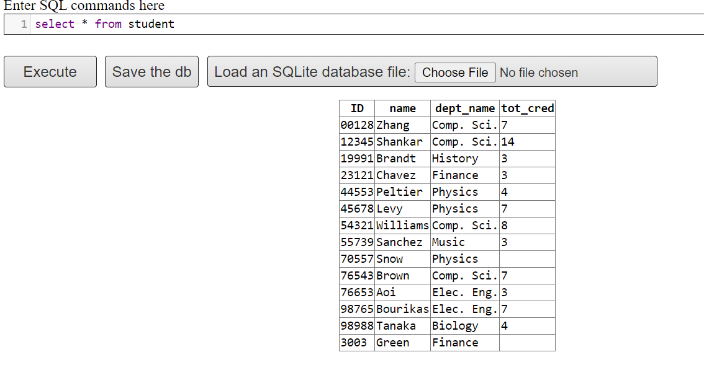