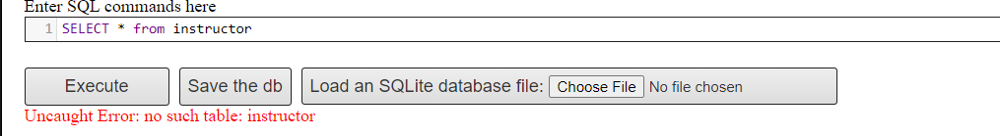
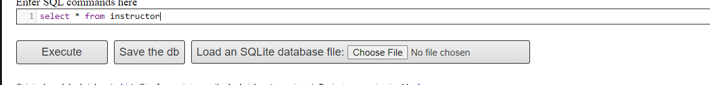

# Introduction to SQL

## CREATE TABLE
``` sql
CREATE TABLE department
(
    dept_name varchar(20),
    building varchar(15),
    budget numeric(12,2),
    primary key (dept_name)
)
CREATE TABLE course
(
     course_id		varchar(8), 
	 title			varchar(50), 
	 dept_name		varchar(20),
	 credits		numeric(2,0) check (credits > 0),
	 primary key (course_id),
	 foreign key (dept_name) references department
		on delete set null
)
CREATE TABLE instructor
(
     ID			varchar(5), 
	 name			varchar(20) not null, 
	 dept_name		varchar(20), 
	 salary			numeric(8,2) check (salary > 29000),
	 primary key (ID),
	 foreign key (dept_name) references department
		on delete set null
)
CREATE TABLE section
(
    course_id		varchar(8), 
    sec_id			varchar(8),
	semester		varchar(6)
		check (semester in ('Fall', 'Winter', 'Spring', 'Summer')), 
	year			numeric(4,0) check (year > 1701 and year < 2100), 
	building		varchar(15),
	room_number		varchar(7),
	time_slot_id		varchar(4),
	primary key (course_id, sec_id, semester, year),
	foreign key (course_id) references course
		on delete cascade,
	foreign key (building, room_number) references classroom
		on delete set null
)    
CREATE TABLE teaches
(
    ID			varchar(5), 
	course_id		varchar(8),
	sec_id			varchar(8), 
	semester		varchar(6),
	year			numeric(4,0),
	primary key (ID, course_id, sec_id, semester, year),
	foreign key (course_id,sec_id, semester, year) references section
		on delete cascade,
	foreign key (ID) references instructor
		on delete cascade
)
```

## DROP TABLE 
``` sql
DROP TABLE instructor
```

This deletes all tuples of  _instructor_, as well as the schema for _instructor_. After  _instructor_ is dropped, no tuples can be inserted into  _instructor_ unless it is re-created with the `CREATE TABLE` command.

## DELETE FROM 
``` sql
DELETE FROM instructor
```
This retains the relation _instructor_ but deletes all tuples in _instructor_.


## ALTER TABLE
``` sql
ALTER TABLE instructor ADD address varchar(20)
```


``` sql
ALTER TABLE instructor drop address
```
We can drop and add attributes in a relation using `ALTER TABLE`

## QUERIES ON A SINGLE RELATION 

To find names of all instructors in the university database: 
``` sql
SELECT name FROM instructor
```


 The instructor's name appears in the name attribute, and then we put in a `select` clause.

To find the department names of all instructors: 
``` sql
SELECT dept_name FROM instructor
```


The result of the above query is aa relation containing all department names, which may contain duplicate values as well since more than one instructors can belong to a department. If we want to force the elimination of duplicates, we insert the keyword `distinct` after `select`. 
``` sql
SELECT distinct dept_name FROM instructor
```


The result of the above query would contain each department name at most once. 

SQL allows us to use the keyword all to specify explicity that duplicates are not removed. 
``` sql
SELECT all dept_name FROM instructor
```

But duplicate retention is defualt, so using `all` is not suggested. 

SQL clause may also contain arithmetic expressions involving operators like `+ , -, *, /` operating on constants or attributes of tuples. 
``` sql
SELECT ID, name, dept_name, salary*1.1 FROM instructor
```

This query returns a relation that is the same as the `instructor` relation, except that the attribute `salary` is mulitiplied by 1.1. This does not result in any change to the `instructor` relation.

To find the names of all instructors in the Computer Science department who have salary greater than $70,000:
``` sql
SELECT name from instructor where dept_name = 'Comp. Sci.' and salary>70000
```


## QUERIES ON MULTIPLE RELATIONS

To retrieve names of all instructors along with their department names and department building name: 

``` sql
select name, instructor.dept_name, building from instructor, department where instructor.dept_name = department.dept_name
```

Cartesian product of the `instructor` relation with `teaches` relation is as follows: 
``` sql
SELECT * FROM instructor, teaches
```

This results in tuples(12*13 = 156) from `instructor` and `teaches` that are unrelated to each other. Instead, we would want a query involving instructor and teaches to combine a particular tuple t in instructor with only those tuples in teaches that refer to the same instructor to which t refers.
``` sql
SELECT name,course_id FROM instructor, teaches where instructor.ID = teaches.ID
```
 

 If we wished to find only instructor names and course identifiers for instructors in the Computer Science departmnet, we could add an extra predicate to the `where` clause:
 ``` sql
SELECT name,course_id FROM instructor, teaches where instructor.ID = teaches.ID and instructor.dept_name = 'Comp. Sci.'
```
 

 ## THE RENAME OPERATION
 
 The `as` clause appears in both the `select` and `from` clauses.
 - If we want the attribute name `name` to be replaced with the 
    name `instructor_name`, we can write:
    ``` sql
    SELECT name as instructor_name, course_id FROM instructor, teaches WHERE instructor.ID = teaches.ID
    ```
    

 - to find names and course_ID all instructors in the university who have taught some course.
    ``` sql
    SELECT T.name, S.course_id FROM instructor as T, teaches as S WHERE T.ID = S.ID
    ```
    
- To compare tuples in the same relation, we would need cartesian product of a relation with itself, and without renaming, it would be impossible to distinguish one tuple from the other. For example, to find the names of all instructors whose salary is strictly greater than atleast one instructor in the Biology department,  
     ``` sql
    SELECT distinct T.name FROM instructor as T, instructor as S WHERE T.salary > S.salary and S.dept_name = 'Biology'
    ```
    


## STRING OPERATIONS

To find the names of all departments whose building name includes the substring 'Watson':
``` sql
SELECT dept_name from department where building like %'Watson'%
```


## ATTRIBUTE SPECIFICATION IN THE SELECT CLAUSE

The asterisk  `*` can be used in the `select` clause to denote "all attributes".
``` sql
select instructor.* from instructor, teaches where instructor.ID = teaches.ID
```


## ORDERING THE DISPLAY OF TUPLES

To list in alphabetic order all instructors in the Physics department: 
``` sql
select name from instructor where dept_name = "Physics" order by name
```


To list the entire `instructor` relation in descending order of `salary`, but ascending order of `name`:
``` sql
select * from instructor order by salary desc, name asc
```


## WHERE - CLAUSE PREDICATES 

To find the names of instructors with salary amounts between $90,000 and $100,000, we use the `between` comparison operator
``` sql
select name from instructor where salary between 90000 and 100000
```


``` sql
select name from instructor where salary between 90000 and 100000
```
The following qeury , 
``` sql
SELECT name,course_id FROM instructor, teaches where instructor.ID = teaches.ID and dept_name = 'Biology'
```
can be rewritted as
``` sql
SELECT name,course_id FROM instructor, teaches where (instructor.ID,dept_name)=(teaches.ID,'Biology')
```


## SET OPERATIONS
__QUERY 1__:
The set of all courses taught in Fall 2017 semester
``` sql
SELECT course_id FROM section where (semester, year) = ('Fall', 2017)
```

__QUERY 2__:
The set of all courses taught in the Spring 2018 semester
``` sql
SELECT course_id FROM section where (semester, year) = ('Spring', 2018)
```

## UNION OPERATION
__QUERY 3__:
Set of all courses taught either in Fall 2017 or Spring 2018, or both
``` sql
SELECT course_id FROM section where (semester, year) = ('Fall', 2017)
union
SELECT course_id FROM section where (semester, year) = ('Spring', 2018)
```

The `union` operation automatically eliminates duplicates. If you want to retain all duplicates, write `union all` in place of `union` 
``` sql
SELECT course_id FROM section where (semester, year) = ('Fall', 2017)
union all
SELECT course_id FROM section where (semester, year) = ('Spring', 2018)
```


## INTERSECT OPERATION

To find the set of all courses taught in both the Fall 2017 and Spring 2018
``` sql
SELECT course_id FROM section where (semester, year) = ('Fall', 2017)
intersect
SELECT course_id FROM section where (semester, year) = ('Spring', 2018)
```

To retain duplicates, 
``` sql
SELECT course_id FROM section where (semester, year) = ('Fall', 2017)
intersect all
SELECT course_id FROM section where (semester, year) = ('Spring', 2018)
```

## EXCEPT OPERATION
To find the courses taught in Fall 2017 semester but not in the Spring 2018 semester:
``` sql
SELECT course_id FROM section where (semester, year) = ('Fall', 2017)
except
SELECT course_id FROM section where (semester, year) = ('Spring', 2018)
```

If you want to retain duplicates, write `except all` instead of `except`
``` sql
SELECT course_id FROM section where (semester, year) = ('Fall', 2017)
except all
SELECT course_id FROM section where (semester, year) = ('Spring', 2018)
```

## NULL VALUES

Find all instructors who appear in the `instructor` relation as null values for `salary`,
``` sql
SELECT name FROM instructor where salary is null
```


SQL allows us to test whether the result of a comparison is unknown, rather than true or false.
``` sql
SELECT name FROM instructor where salary>10000 is unknown
```

## AGGREGATE FUNCTIONS

### BASIC AGGREGATION
Find the average salary of instructors in the Computer Science department:
``` sql
SELECT avg(salary) FROM instructor where dept_name = "Comp. Sci."
```

The database system may give an awkward name to the result relation attribute, so we give a meaningful name to the attribute using the `as` clause: 
``` sql
SELECT avg(salary) as avg_salary FROM instructor where dept_name = "Comp. Sci."
```


Find the total number of instructors who teach a course in the Spring 2018 semester:
``` sql
SELECT count(distinct ID) FROM teaches where (semester,year)=('Spring',2018)
```


We can use the aggregate function `count` to count the number of tuples in a relation.
``` sql
SELECT *count(*) FROM course
```


### AGGREGATION WITH GROUPING
`group by` clause are used to form groups.
To find the average salary in each department:
``` sql
SELECT dept_name, avg(salary) as average_salary FROM instructor group by dept_name
```


To find the average salary of all instructors
``` sql
SELECT avg(salary) FROM instructor 
```


To find the number of instructors in each department who teach a course in the Spring 2018 semester
``` sql
SELECT dept_name, count(distinct teaches.ID) as instructor_count FROM instructor,teaches where 
instructor.ID = teaches.ID and semester = 'Spring' and year = 2018 group by dept_name
```


### THE HAVING CLAUSE

To find the average salary of instructors in those departments where the average salary is more than $42,000:
``` sql
SELECT dept_name, avg(salary) as avg_salary from instructor group by dept_name having avg(salary)>42000
```


__QUERY:__ For each course section offered in 2017, find the average total credits (tot_cred) of all students enrolled in the section, if section has at least 2 students
``` sql
SELECT course_id, semester, year, sec_id, avg(tot_cred) FROM student, takes WHERE
student.ID = takes.ID and year = 2017
group by course_id, semester, year, sec_id
having count(ID)>=2
```


